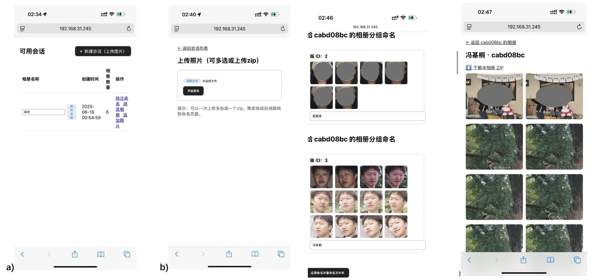

# FaceCluster — Intelligent Photo Album System (YuNet + SFace + DBSCAN)

FaceCluster is a lightweight, session-based photo album system that detects faces, extracts embeddings, clusters people, and exports per-person albums with representative thumbnails. A Flask web UI is included for session management, uploads, labeling/merging clusters, browsing albums, and downloading ZIP packages.


## What it does

**Pipeline**
1. Upload photos (single images or a ZIP archive)
2. Preprocess / normalize inputs
3. Face detection & alignment (**OpenCV YuNet**)
4. Face embedding extraction (**OpenCV SFace**)
5. Clustering (**DBSCAN**)
6. Export albums + thumbnails
7. Optionally rename/merge clusters from the UI

**Key features**
- Session-based workspace per run (`workspace/<session_id>/...`)
- Batch uploads (multi-file) and ZIP extraction
- Cluster labeling and merge-by-name (same label merges to one album folder)
- Album grid browsing and ZIP download

---

## Requirements

- Python 3.10+ recommended
- OpenCV **contrib** build is required (for `FaceDetectorYN_create` / `FaceRecognizerSF`)

---

## Quick start

### 1) Create and activate a virtual environment (recommended)

```bash
python -m venv .venv

# macOS / Linux
source .venv/bin/activate

# Windows PowerShell
# .\.venv\Scripts\Activate.ps1
```

### 2) Install dependencies

You can start with:

```bash
pip install -U pip
pip install -r requirements.txt
```

### 3) Download Model files (ONNX)

```bash
mkdir -p models

curl -L -o models/face_detection_yunet_2023mar.onnx \
  https://github.com/opencv/opencv_zoo/raw/main/models/face_detection_yunet/face_detection_yunet_2023mar.onnx

curl -L -o models/face_recognition_sface_2021dec.onnx \
  https://github.com/opencv/opencv_zoo/raw/main/models/face_recognition_sface/face_recognition_sface_2021dec.onnx
```

---

## Running the web app

From the `FaceCluster/` directory (same level as `Main.py`):

```bash
python Main.py
```

The server starts on:

- `http://127.0.0.1:5000/` (local)
- binds to `0.0.0.0:5000` by default (LAN-accessible)

> Note: `debug=True` and `use_reloader=False` are configured in `Main.py`.

---

## Typical usage (Web UI)

1. Open the home page (session list)
2. Create a new session
3. Upload images (multiple files) or upload a ZIP archive
4. Start processing/clustering from the UI
5. Review clusters (thumbnails)
6. Apply labels (renaming) and merge clusters by assigning the same label
7. Browse albums and download a ZIP for any album

---

## Output behavior and notes

- Albums are exported under `workspace/<sid>/output/albums/`
- Thumbnails are exported under `workspace/<sid>/output/thumbnails/`
- The pipeline includes a project-specific behavior documented in `Service/cluster_service.py`:
  - Images with **no detected faces** may be copied into all “person” subsets (so context photos remain accessible from each album).

---

## Relevant routes (for developers)

Implemented in `Controller/web.py`:

- `GET /` — list sessions
- `GET /new` — create a session
- `GET /add/<sid>` — upload page for a session
- `POST /upload` — handle upload (images/ZIP)
- `GET /label/<sid>` — show clusters for labeling/merging
- `POST /apply_names/<sid>` — apply labels and merge-by-name
- `GET /browse/<sid>` — browse albums
- `GET /album/<sid>/<album>` — view one album
- `GET /download/<sid>/<album>` — download one album as ZIP
- `POST /rebuild/<sid>` — rebuild outputs for the session

---

## Troubleshooting

### `AttributeError: module 'cv2' has no attribute 'FaceDetectorYN_create'`
You installed a non-contrib OpenCV package. Fix:

```bash
pip uninstall -y opencv-python opencv-python-headless
pip install opencv-contrib-python-headless==4.8.1.78
```

### Model not found
Ensure the following files exist relative to the working directory:

```text
models/face_detection_yunet_2023mar.onnx
models/face_recognition_sface_2021dec.onnx
```

### Slow processing on large photo sets
Face detection + embedding extraction are the dominant costs. Consider:
- downscaling inputs before processing
- running on a machine with more CPU cores
- moving the pipeline to a background worker (Celery/RQ) if you need non-blocking UI

---

## License

No license file is included. If you intend to distribute this project, add a license that matches your requirements and ensure the model distribution terms are acceptable for your use case.
